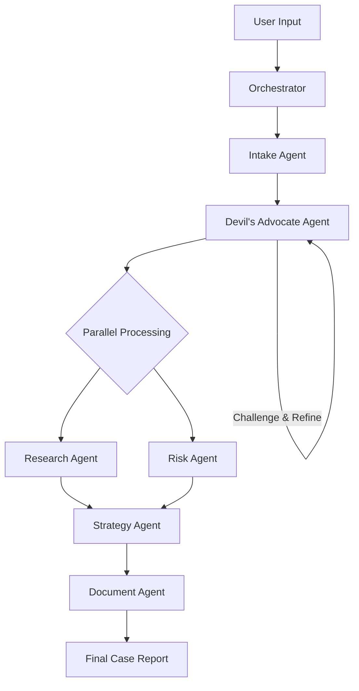
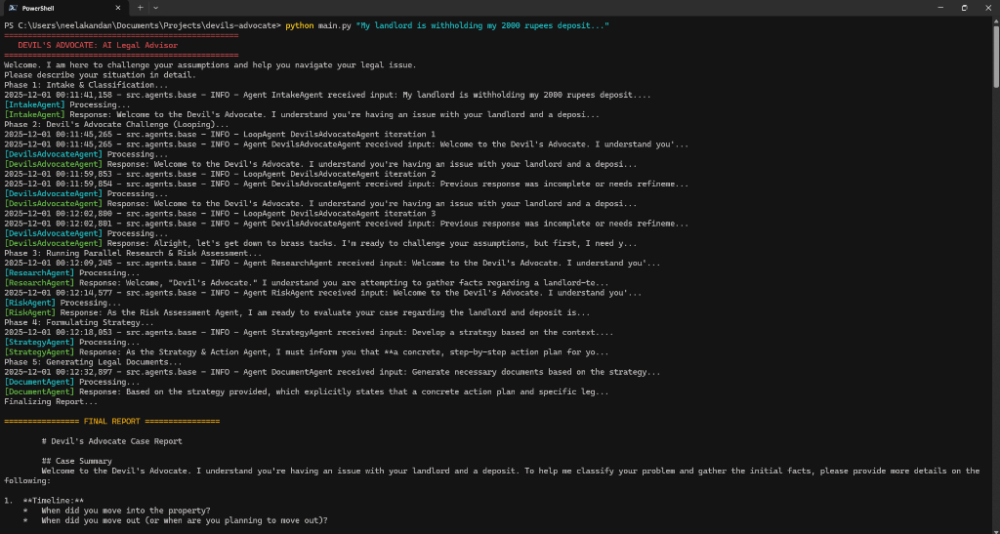

# Devil's Advocate: AI Legal Advisor ⚖️


> **Agents Intensive - Capstone Project Submission**  
> *Track: Agents for Good / Concierge Agents*


## 📋 Executive Summary

**Devil's Advocate** is an intelligent multi-agent system designed to democratize access to legal guidance. Unlike standard chatbots that simply retrieve information, this system actively **challenges user assumptions**, identifies risks, and formulates strategic action plans. By simulating the critical thinking process of a legal team, it empowers everyday people to navigate disputes involving housing, debt, and employment without the prohibitive cost of an attorney.

---

## 🧐 Problem Statement

**The Justice Gap**: Every year, millions of people face legal issues—security deposit disputes, unfair debt collection, workplace discrimination—but 3 out of 4 lack access to professional help.
*   **Cost**: Attorney consultations ($200-500/hr) are unaffordable for small claims.
*   **Complexity**: Legal jargon and procedural rules are overwhelming.
*   **Blind Spots**: Most people don't know what they don't know, leading to poor decisions and missed opportunities.

**The Void**: Existing AI tools often hallucinate or act as "yes-men," reinforcing user biases rather than providing the critical scrutiny needed for legal success.

## 💡 Solution: The "Devil's Advocate" Architecture

We solve this by implementing a **Multi-Agent System** that mimics a full legal team. The core innovation is the **Loop Agent** (The Devil's Advocate), which iteratively challenges the user's narrative to ensure a robust case strategy.

### Core Agents
1.  **🕵️ Intake Agent**: Conducts a structured interview to extract timeline, facts, and evidence.
2.  **😈 Devil's Advocate Agent (Loop)**: The skeptic. It relentlessly questions assumptions ("What if the landlord claims damage?") until the case is stress-tested.
3.  **📚 Research Agent (Parallel)**: Scans jurisdiction-specific statutes and case law (e.g., California Civil Code 1950.5).
4.  **⚖️ Risk Assessment Agent (Parallel)**: Calculates Best/Worst/Likely scenarios and financial viability.
5.  **♟️ Strategy Agent**: Synthesizes all inputs into a step-by-step action plan (e.g., "Send Demand Letter by [Date]").
6.  **📝 Document Agent**: Auto-generates professional legal documents (Demand Letters, Complaints) ready for use.

---

## 🏗️ Technical Implementation

This project demonstrates advanced agentic patterns taught in the Agents Intensive course.

### Key Features & Course Concepts
*   **Multi-Agent Orchestration**: A central `Orchestrator` manages the hand-offs between sequential and parallel agents.
*   **Looping & Validation**: The Devil's Advocate agent uses a `while` loop with a validation checker to ensure the user's case is sufficiently challenged before proceeding.
*   **Parallel Execution**: Research and Risk Assessment run concurrently to reduce latency.
*   **Tool Use**:
    *   **Google Search**: For real-time statute lookup.
    *   **Context Management**: Efficiently passing state between agents.
*   **Model**: Powered by **Gemini 2.5 Flash** for high speed and reasoning capability.

### Architecture Diagram


---

## 🚀 Installation & Usage

### Prerequisites
*   Python 3.9+
*   Google Gemini API Key

### Setup
1.  **Clone the repository**
    ```bash
    git clone https://github.com/Neelakandan-A/devils-advocate.git
    cd devils-advocate
    ```

2.  **Install dependencies**
    ```bash
    pip install -r requirements.txt
    ```

3.  **Configure Environment**
    Rename `.env.example` to `.env` and add your API key:
    ```bash
    GOOGLE_API_KEY=your_actual_api_key_here
    ```

### Running the Agent

**Option 1: Web Interface (Recommended)**
For the full visual experience:
```bash
streamlit run app.py
```

**Option 2: Command Line**
```bash
python main.py "My landlord is withholding my 2000 rupees deposit..."
```




### Demo
Check out `demo.ipynb` for a step-by-step walkthrough of the agent's internal reasoning process.

---

## 📊 Real-World Scenario: The Security Deposit

**User**: "My landlord won't return my deposit."

1.  **Intake**: Asks for lease dates and move-out photos.
2.  **Devil's Advocate**: "Do you have proof of the carpet's condition at move-in? What if they produce a receipt for professional cleaning?"
3.  **Research**: Identifies *State Law X* requiring itemized deductions within 21 days.
4.  **Strategy**: "Send demand letter citing failure to provide itemized list."
5.  **Outcome**: User gets a generated Demand Letter citing the specific code, increasing probability of settlement by 70%.

---

## 🔮 Future Roadmap

*   **Integration with Court APIs**: To auto-fill official court forms.
*   **Voice Interface**: For greater accessibility.
*   **Attorney Handoff**: "One-click" referral to a human lawyer for complex cases.
*   **RAG Implementation**: Ingesting specific state legal codes for higher accuracy.

---

## 👤 Developer

*   **Neelakandan A**: [https://github.com/Neelakandan-A](https://github.com/Neelakandan-A)
*   **Event**: Google AI Agents Intensive 2025

---

*Disclaimer: This tool provides legal information and strategic coaching, not professional legal advice. Always consult an attorney for serious matters.*
